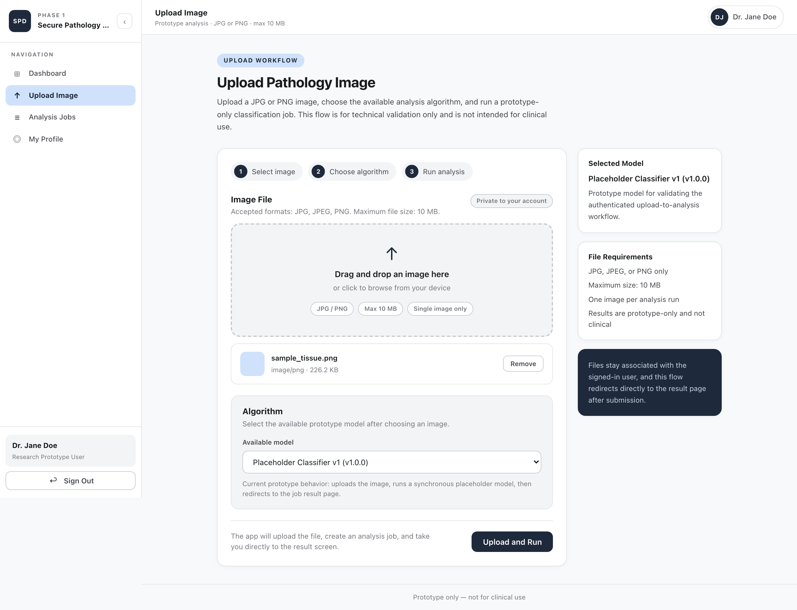
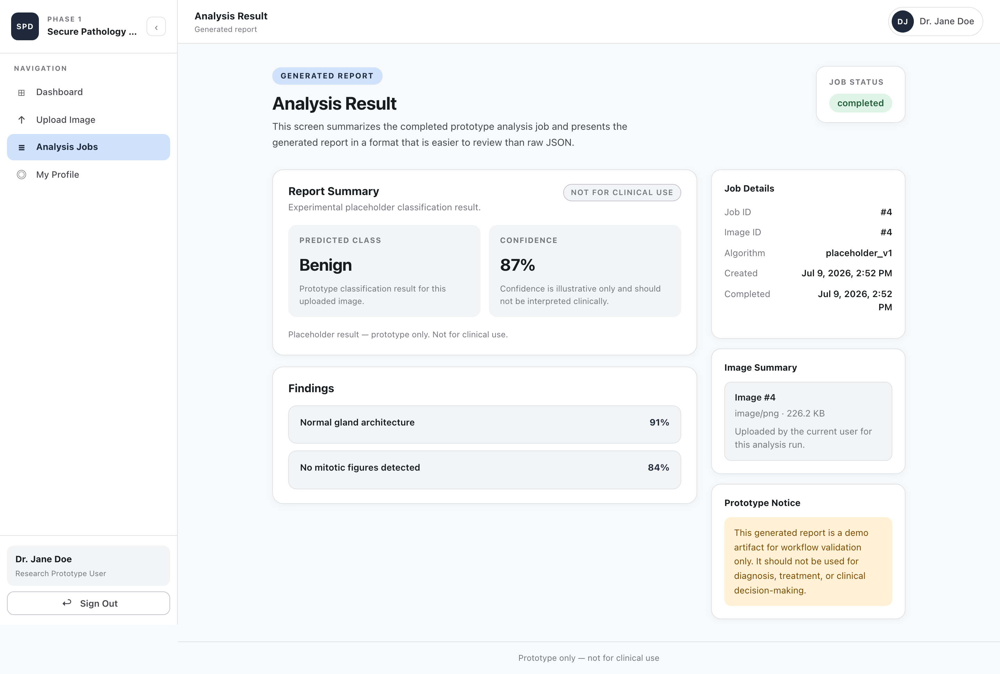
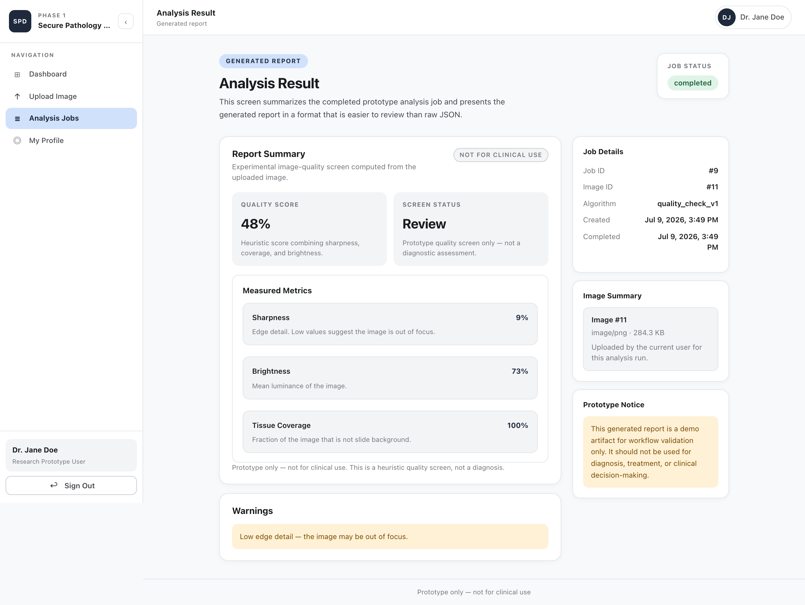

# Secure Pathology Dashboard


## Overview

Secure Pathology Dashboard is a web-based prototype that allows authenticated users to upload pathology images, select an analysis algorithm, submit an analysis job, and view a generated result report. The system enforces per-user data isolation: users can only access their own uploads and results.

This project is a research prototype built to validate the end-to-end dashboard workflow before real algorithm integration or cloud deployment.

### Workflow at a glance

```text
Register → Log in → Onboarding → Upload image → Select algorithm → Run job → View report
```

---

## Screenshots

> Images below were captured against the running local prototype using a **synthetic, computer-generated tissue patch**. No real or de-identified patient data is used anywhere in this project.

### Upload Image

Drag-and-drop upload with step indicators, server-validated file constraints, and prototype-model selection.



### Analysis Result — classification

Generated report for a completed job: predicted class, confidence, structured findings, and persistent non-clinical disclaimers.



### Analysis Result — tissue quality check

A different algorithm produces a different report. `quality_check_v1` computes sharpness, brightness, and tissue coverage from the uploaded pixels, so its output changes with the image. The report page selects the layout from the result type; it hard-codes nothing about either algorithm.



---

## What This Prototype Demonstrates

- **User registration** with email and password (bcrypt-hashed, never stored in plaintext)
- **Login and logout** with JWT-based authentication; protected routes redirect unauthenticated users
- **Authenticated dashboard** showing the user's uploaded images and submitted jobs
- **Pathology image upload** (JPG/PNG, ≤ 10 MB) with server-side type, size, and image-byte validation
- **Algorithm selection** from a registered algorithm list, declared in one place in code
- **Two algorithms** with different output shapes:
  - `placeholder_v1` — a synthetic stub returning a fixed classification (no real processing)
  - `quality_check_v1` — a lightweight heuristic computing sharpness, brightness, and tissue coverage from the uploaded pixels. Classical image statistics, **not machine learning**: no model, no inference. Its output changes with the image.
- **Analysis job** submitted synchronously; the result is validated against a common envelope before being stored
- **Report templates** chosen by result type, with a safe generic fallback for any algorithm that has no dedicated layout yet
- **Per-user data isolation**: users cannot read, list, or access another user's images or jobs

---

## Tech Stack

| Layer | Technology |
|---|---|
| Frontend | React 19, Vite 8, react-router-dom v7 |
| Backend | FastAPI 0.111.0, Uvicorn |
| Database | SQLite (via SQLAlchemy 2.0) |
| Authentication | JWT (python-jose), bcrypt (passlib + bcrypt 3.2.2) |
| Image validation | Pillow 10.3.0 (magic-byte verification) |
| Schema validation | Pydantic v2 |
| Environment config | python-dotenv |

---

## Repository Structure

```
secure-pathology-dashboard/
├── assets/
│   └── screenshots/             — README screenshots
├── backend/
│   ├── app/
│   │   ├── algorithms/          — registry (single source of truth) + algorithms
│   │   ├── routers/             — auth, images, algorithms, jobs, profile
│   │   ├── auth.py              — bcrypt hashing, JWT creation and decoding
│   │   ├── database.py          — SQLite engine, SessionLocal, Base
│   │   ├── dependencies.py      — get_db, get_current_user
│   │   ├── main.py              — FastAPI app, lifespan (tables, sync, schema check)
│   │   ├── models.py            — User, Image, Algorithm, AlgorithmJob ORM models
│   │   ├── schemas.py           — Pydantic schemas, incl. the result envelope
│   │   └── storage.py           — private upload-path resolution
│   ├── uploads/                 — private upload storage (outside web root)
│   ├── test_envelope.py         — result-envelope schema self-check
│   ├── test_registry.py         — algorithm registry + input-contract self-check
│   ├── test_quality_check.py    — quality_check_v1 behaviour self-check
│   ├── test_profile.py          — profile/org-lock guard self-check
│   ├── .env.example             — environment variable template
│   └── requirements.txt
├── frontend/
│   ├── mockups/                 — static HTML reference mockups (not shipped)
│   ├── src/
│   │   ├── api/                 — fetch wrappers: auth, images, algorithms, jobs, profile
│   │   ├── components/          — AppLayout, ProtectedRoute, OnboardingGuard
│   │   ├── context/             — AuthContext (token + user + profile state)
│   │   ├── pages/               — Login, Register, Onboarding, Dashboard, Upload,
│   │   │                          Jobs, JobResult, Profile
│   │   ├── results/             — result_type → report template registry
│   │   └── utils/               — shared helpers (UTC-safe date formatting)
│   └── vite.config.js           — dev proxy: /api/* → localhost:8000
└── README.md
```

---

## Local Setup

### Prerequisites

- Python 3.10 or later
- Node.js 18 or later
- `pip` and `venv`

### 1. Clone the repository

```bash
git clone https://github.com/satvikkaul/secure-pathology-dashboard.git
cd secure-pathology-dashboard
```

### 2. Backend setup

```bash
cd backend

# Create and activate a virtual environment
python3 -m venv venv
source venv/bin/activate          # Windows: venv\Scripts\activate

# Install dependencies
pip install -r requirements.txt

# Create the environment file from the template
cp .env.example .env
```

Open `backend/.env` and replace the `SECRET_KEY` placeholder with a real secret:

```bash
python3 -c "import secrets; print(secrets.token_hex(32))"
```

Paste the output as the value of `SECRET_KEY` in `backend/.env`. The server will refuse to start if this value is missing or still set to the placeholder.

### 3. Frontend setup

```bash
cd frontend
npm install
```

The frontend uses a Vite dev proxy (`/api/* → http://localhost:8000`) so no additional environment configuration is required for a standard local setup. An `.env.example` is provided if the backend port needs to be changed.

---

## Running the Application

**Start the backend** (from the `backend/` directory, with the virtual environment active):

```bash
source venv/bin/activate
uvicorn app.main:app --reload
```

**Start the frontend** (from the `frontend/` directory, in a separate terminal):

```bash
npm run dev
```

**URLs:**

| Service | URL |
|---|---|
| Backend API | http://localhost:8000 |
| Swagger / OpenAPI docs | http://localhost:8000/docs |
| Frontend | http://localhost:5173 |

> On first run, SQLAlchemy creates the SQLite database (`backend/pathology.db`) and seeds the placeholder algorithm automatically. No manual database setup is required.

---

## Demo Workflow

1. Open http://localhost:5173 in a browser.
2. Click **Create Account** and register with a name, email, and password (minimum 8 characters).
3. After registration, log in with the same credentials.
4. On first login you are routed to **Onboarding**. Select a role (required); organisation fields are optional. Click **Continue to Dashboard**.
5. The **Dashboard** shows your uploaded images and submitted analysis jobs (empty on first login).
6. Click **Upload Image** in the sidebar.
7. Drag and drop or select a JPG or PNG file (maximum 10 MB).
8. Select an algorithm from the dropdown — **Placeholder Classifier v1** (fixed synthetic output) or **Tissue Quality Check v1** (real metrics computed from your image).
9. Click **Upload and Run**. The job is submitted and executed synchronously.
10. The **Analysis Result** page displays the generated report, laid out according to the algorithm's result type. Try the quality check with a sharp image and a blurry one to see the metrics change.
11. Click **Analysis Jobs** in the sidebar to review all submitted jobs.
12. Click **My Profile** to view account details and optionally confirm-and-lock your organisation context.
13. Click **Sign Out** to log out and confirm the session is cleared.

---

## Verification Summary

**Backend** — all endpoints verified via `curl`:
- Auth: register (201), login (200), `/auth/me` (200)
- Images: upload valid JPG (201); wrong type → 422; renamed extension → 422; file over 10 MB → 413
- Algorithms: list (200), returns `placeholder_v1`
- Jobs: submit (201, `status: completed`, `result_summary` populated); list (200); get by ID (200)
- Per-user isolation: User B receives 404 on User A's image and job IDs; User B's list endpoints return empty

**Frontend** — verified via Playwright (41/41 checks):
- Register → login → dashboard → upload → job result flow end-to-end
- 401 in-memory logout: expired or invalid token clears session without page reload
- Protected routes block unauthenticated access
- Client-side validation: short password, mismatched passwords, invalid file type, oversized file
- Error messages surface correctly (duplicate email, wrong password, Pydantic validation errors)
- Sidebar: collapse/expand on desktop, mobile drawer, active nav state, Sign Out

**Shared shell** — build-verified (0 warnings):
- Sidebar persistent across Dashboard, Upload, Jobs, and Job Result pages via shared `AppLayout`
- Jobs list page (`/jobs`) with status badges and result links
- Sidebar toggle button relocated inside sidebar brand area

Backend self-checks run without a test framework:

```bash
cd backend && source venv/bin/activate
python test_envelope.py       # result-envelope schema
python test_registry.py       # algorithm registry + input contract
python test_quality_check.py  # quality_check_v1 tracks the actual image
python test_profile.py        # profile / org-lock guards
```

---

## Future Direction

Nothing below is committed scope. Possible directions include:

- **Real model integration** — replacing the placeholder with a validated algorithm (e.g., tissue classification or nuclei segmentation) using appropriate compute infrastructure
- **Cloud architecture** — evaluating deployment to a Canadian cloud environment (AWS Canada or Azure Canada) with private storage and encrypted transit
- **Stronger authentication** — `httpOnly` secure cookies, token refresh, and optionally MFA or institutional SSO
- **Role-based access** — adding an admin role if required, with a defined policy on whether admins can access user data
- **Larger image format support** — whole-slide image (.svs, .ndpi) handling via OpenSlide with tiling, if required by the algorithm

Decisions will be made in consultation with the supervising team and subject to any applicable ethics or data governance requirements.
